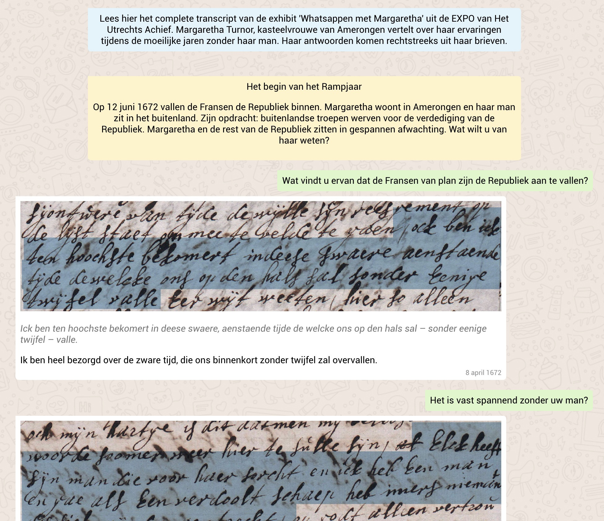

# Whatsappen met Margaretha Turnor
```
      _     __)                                                                                       
    (, /|  /|   ,  ,        /)                           /) ,                   /)                    
      / | / |       __     (/    _   _  __     _ __     //     _  _  _/_  _    (/   _   __ _/_ _    _ 
   ) /  |/  |__(_ /_/ (_   / )__(/__(/_/ (_  _(/_/ (_  (/__(__(/_/_)_(___(/_   / )_(_(_/ (_(__(_/__(/_
  (_/   '      .-/                                                                           .-/      
              (_/                                                                           (_/
```

Het complete transcript van de exhibit 'Whatsappen met Margaretha' uit de EXPO van Het Utrechts Achief.

Lees hier  (https://hualab.nl/margaretha/chat) het complete WhatsApp transcript/verslag van de exhibit 'Whatsappen met Margaretha' uit de EXPO van Het Utrechts Achief. 

Margaretha Turnor, kasteelvrouwe van Amerongen, vertelt over haar ervaringen tijdens de moeilijke jaren zonder haar man. Haar antwoorden komen rechtstreeks uit haar brieven.

De exhibit in de EXPO heeft, in tegenstelling tot de weergave hier, een interactief component waarbij je zelf je route door de verhaal bepaald. De code voor de exhibit is eveneens open source en is op verzoek beschikaar.




